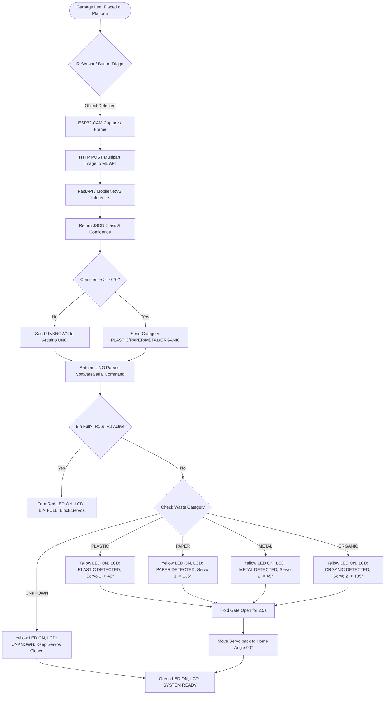

# IoT-Based Automatic Garbage Segregation System

A complete production-ready **IoT Automatic Garbage Segregation System** powered by an **ESP32-CAM**, **Arduino UNO R3**, **TensorFlow / FastAPI Machine Learning Classification API**, **Dual Servo Motors**, **16×2 I2C LCD Display**, **3 Status LEDs**, and **2 IR Fill-Level Proximity Sensors**.

---

## 🏗️ System Architecture & Workflow



---

## 🔌 Complete Wiring Table & Pin Assignment

### 1. Arduino UNO Pin Connections

| Arduino Pin | Attached Component | Function / Signal | Connection Details |
| :--- | :--- | :--- | :--- |
| **D2** | Green LED Anode | System Ready Indicator | Via 220Ω Resistor $\rightarrow$ Green LED $\rightarrow$ GND |
| **D3** | Yellow LED Anode | Detecting / Sorting / Warning | Via 220Ω Resistor $\rightarrow$ Yellow LED $\rightarrow$ GND |
| **D4** | Red LED Anode | Bin Full / System Fault | Via 220Ω Resistor $\rightarrow$ Red LED $\rightarrow$ GND |
| **D5** | IR Sensor 1 Out | Bin Warning Level Sensor | VCC $\rightarrow$ 5V, GND $\rightarrow$ GND, OUT $\rightarrow$ D5 |
| **D6** | IR Sensor 2 Out | Bin Full Level Sensor | VCC $\rightarrow$ 5V, GND $\rightarrow$ GND, OUT $\rightarrow$ D6 |
| **D7** | ESP32-CAM TX (GPIO 1) | SoftwareSerial RX | Receives classification commands from ESP32 |
| **D8** | ESP32-CAM RX (GPIO 3) | SoftwareSerial TX | Transmits status frames to ESP32 |
| **D9** | Servo Motor 1 Signal | Plastic / Paper Chute Gate | Signal $\rightarrow$ D9, VCC $\rightarrow$ Ext 5V, GND $\rightarrow$ Common GND |
| **D10** | Servo Motor 2 Signal | Metal / Organic Chute Gate | Signal $\rightarrow$ D10, VCC $\rightarrow$ Ext 5V, GND $\rightarrow$ Common GND |
| **A4** | 16x2 I2C LCD SDA | Display Data | VCC $\rightarrow$ 5V, GND $\rightarrow$ GND, SDA $\rightarrow$ A4 |
| **A5** | 16x2 I2C LCD SCL | Display Clock | VCC $\rightarrow$ 5V, GND $\rightarrow$ GND, SCL $\rightarrow$ A5 |

### 2. ESP32-CAM Pin Connections

| ESP32-CAM Pin | Attached Component | Function | Connection Details |
| :--- | :--- | :--- | :--- |
| **GPIO 1 (TX)** | Arduino Pin D7 | UART Transmit | Sends category strings (`PLASTIC`, `PAPER`, etc.) |
| **GPIO 3 (RX)** | Arduino Pin D8 | UART Receive | Receives serial acknowledgments |
| **GPIO 4** | Onboard Flash LED | Illumination Flash | Built-in high-brightness LED |
| **GPIO 13** | IR Trigger / Push Button | Hardware Capture Trigger | Active LOW (Triggered when pulled to GND) |
| **5V / GND** | 5V Regulated Power | Main ESP32 Power | External 5V 2A supply / Common GND |

### 3. LED Circuit Diagram

```text
Arduino D2 ----> [ 220Ω Resistor ] ----> ( Anode ) GREEN LED ( Cathode ) ----> Common GND
Arduino D3 ----> [ 220Ω Resistor ] ----> ( Anode ) YELLOW LED ( Cathode ) ----> Common GND
Arduino D4 ----> [ 220Ω Resistor ] ----> ( Anode ) RED LED ( Cathode ) ----> Common GND
```

---

## ⚡ Important Power Supply & Grounding Requirements

> [!CAUTION]
> 1. **Do NOT Power Servos from Arduino 5V Pin**: Servo motors draw high peak currents (up to 1A–2A under load) which will cause the Arduino 5V regulator to brown out and reset. Use a dedicated regulated 5V (2A+) external power supply or 5V 3A DC buck converter module for the servos.
> 2. **Common Ground Mandate**: You **MUST** connect the GND of the external 5V power supply, Arduino UNO GND, ESP32-CAM GND, LCD GND, and IR Sensor GND together into a single common ground bus.

---

## 📦 Required Libraries & Installation Instructions

### Arduino UNO Libraries (Arduino IDE)

Open Arduino IDE $\rightarrow$ **Sketch** $\rightarrow$ **Include Library** $\rightarrow$ **Manage Libraries...** and install:

1. **`Servo`**: Built-in standard library by Michael Margolis / Arduino.
2. **`SoftwareSerial`**: Built-in standard library.
3. **`LiquidCrystal_I2C`**: Search for `LiquidCrystal_I2C` by **Frank de Brabander** (or Marco Schwartz) and click **Install**.

### ESP32-CAM Libraries (Arduino IDE)

1. **ESP32 Board Support Package**:
   - Go to **File** $\rightarrow$ **Preferences**.
   - Add URL to **Additional Boards Manager URLs**:
     `https://raw.githubusercontent.com/espressif/arduino-esp32/gh-pages/package_esp32_index.json`
   - Go to **Tools** $\rightarrow$ **Board** $\rightarrow$ **Boards Manager...**, search for `esp32` by **Espressif Systems** and install version `2.0.x` or `3.0.x`.
   - Select Board: **AI Thinker ESP32-CAM**.
   - Set Partition Scheme: **Huge APP (3MB No OTA / 1MB SPIFFS)**.
   - Set PSRAM: **Enabled**.

2. **`ArduinoJson`**:
   - Go to **Manage Libraries...**, search for `ArduinoJson` by **Benoit Blanchon** and install **Version 6.x or Version 7.x**.

### Python Machine Learning API Server Dependencies

```bash
# Create and activate Python virtual environment
python -m venv venv
# On Windows PowerShell:
.\venv\Scripts\Activate.ps1

# Install requirements
pip install -r requirements.txt
```

---

## 📡 ESP32-CAM to Arduino UNO Serial Communication Protocol

- **Physical Media**: SoftwareSerial UART on Arduino Pins D7 (RX) and D8 (TX) connected to ESP32 GPIO 1 (TX) and GPIO 3 (RX).
- **Baud Rate**: `9600 bps`, 8 Data bits, No parity, 1 Stop bit (8N1).
- **Message Format**: ASCII string terminated with linefeed `\n`.

| Transmitted String | Waste Category | Arduino UNO Action | Servo 1 Angle | Servo 2 Angle |
| :--- | :--- | :--- | :--- | :--- |
| `PLASTIC\n` | Plastic Waste | LCD: `PLASTIC DETECTED`, Yellow LED ON | Sweeps to `45°` | Home (`90°`) |
| `PAPER\n` | Paper Waste | LCD: `PAPER DETECTED`, Yellow LED ON | Sweeps to `135°` | Home (`90°`) |
| `METAL\n` | Metal Waste | LCD: `METAL DETECTED`, Yellow LED ON | Home (`90°`) | Sweeps to `45°` |
| `ORGANIC\n` | Organic Waste | LCD: `ORGANIC DETECTED`, Yellow LED ON | Home (`90°`) | Sweeps to `135°` |
| `UNKNOWN\n` | Low Confidence / Error | LCD: `UNKNOWN`, Yellow LED ON | Home (`90°`) | Home (`90°`) |

---

## ⚙️ Configurable Parameters Reference

### Arduino UNO Code (`arduino_uno/arduino_uno.ino`)

```cpp
// IR Sensor Logic (true = active LOW sensor, false = active HIGH sensor)
const bool IR_ACTIVE_LOW = true;

// Servo Angles (Modify based on physical mechanical gates)
const int SERVO1_HOME         = 90;  // Neutral closed position
const int SERVO1_SORT_PLASTIC = 45;  // Plastic bin angle
const int SERVO1_SORT_PAPER   = 135; // Paper bin angle

const int SERVO2_HOME         = 90;  // Neutral closed position
const int SERVO2_SORT_METAL   = 45;  // Metal bin angle
const int SERVO2_SORT_ORGANIC = 135; // Organic bin angle
```

### ESP32-CAM Code (`esp32_cam/esp32_cam.ino`)

```cpp
// Machine Learning Confidence Threshold (0.0 to 1.0)
const float CONFIDENCE_THRESHOLD = 0.70; // 70% threshold

// Server API Endpoint
const char* SERVER_URL = "http://192.168.86.189:8000/predict";
```

---

## 🧪 Individual Component Testing Instructions (Step-by-Step)

Before running the full integrated system, test each hardware module independently:

### Step 1: LCD Display & LED Status Test
1. Upload `arduino_uno.ino` to Arduino UNO.
2. Open Serial Monitor at `9600 baud`.
3. Verify that LCD displays `INITIALIZING...` and then `SYSTEM READY`.
4. Observe Green LED turning ON solid.

### Step 2: IR Sensors & Bin Full Priority Test
1. Place an object in front of **IR Sensor 1** (Pin D5). Verify LCD shows `BIN WARNING` and Yellow LED turns ON.
2. Place objects in front of **both IR Sensor 1 and IR Sensor 2** (Pins D5 & D6).
3. Verify LCD shows `BIN FULL`, Red LED turns ON, and Green/Yellow LEDs turn OFF.
4. Attempt sending serial text `PLASTIC` via SoftwareSerial or test script. Verify sorting is **blocked** while bin is full.

### Step 3: Servo Motors Calibration Test
1. Verify servos are powered by external 5V power supply.
2. Observe startup sequence: both Servo 1 and Servo 2 should smoothly move to `90°` home position.
3. Open Arduino Serial Monitor and send `PLASTIC`, `PAPER`, `METAL`, `ORGANIC` manual string commands to simulate classification payloads.
4. Verify smooth gate movement without current dips or resets.

### Step 4: ESP32-CAM Wi-Fi & Camera Test
1. Connect ESP32-CAM to PC via FTDI programmer (Bridge GPIO 0 to GND while uploading).
2. Upload `esp32_cam.ino`.
3. Disconnect GPIO 0 from GND and press ESP32 Reset button.
4. Open Serial Monitor at `9600 baud`. Verify `[OK] OV2640 Camera driver initialized` and `[OK] Wi-Fi Connected! Device Assigned IP: ...`.

### Step 5: Machine Learning API Endpoint Test
1. Start Python server:
   ```bash
   python -m uvicorn app.main:app --host 0.0.0.0 --port 8000
   ```
2. Open web browser and navigate to `http://localhost:8000/health`. Verify `{"status": "ok", "model_loaded": true}`.
3. Test inference endpoint using curl:
   ```bash
   curl -X POST "http://localhost:8000/predict" -F "image=@sample_trash.jpg"
   ```

### Step 6: Complete Integrated System Operational Test
1. Place garbage item on platform trigger point.
2. Verify sequence:
   - ESP32 Flash LED flashes $\rightarrow$ Image captured.
   - HTTP POST sent to FastAPI server.
   - ML server classifies image and returns JSON.
   - ESP32 validates confidence $\rightarrow$ Transmits category to Arduino over SoftwareSerial.
   - Arduino LCD displays `PLASTIC DETECTED` (or mapped category) and `SORTING...`.
   - Yellow LED turns ON.
   - Designated Servo motor opens gate for 2.5 seconds $\rightarrow$ Item drops into bin.
   - Servo gate returns home $\rightarrow$ Green LED turns ON $\rightarrow$ LCD displays `SYSTEM READY`.
